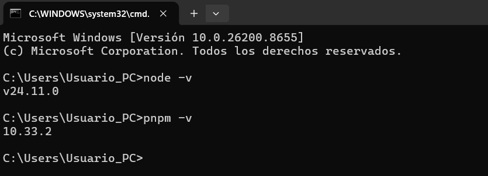
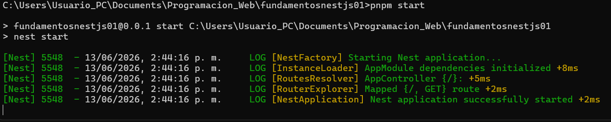
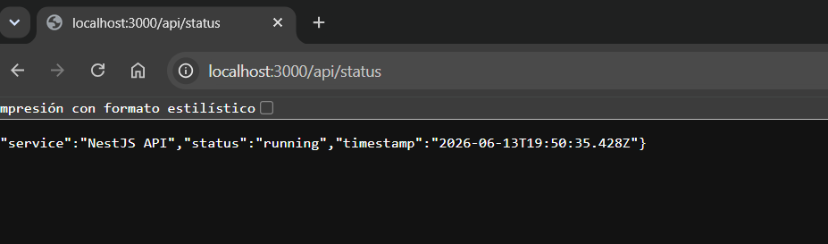
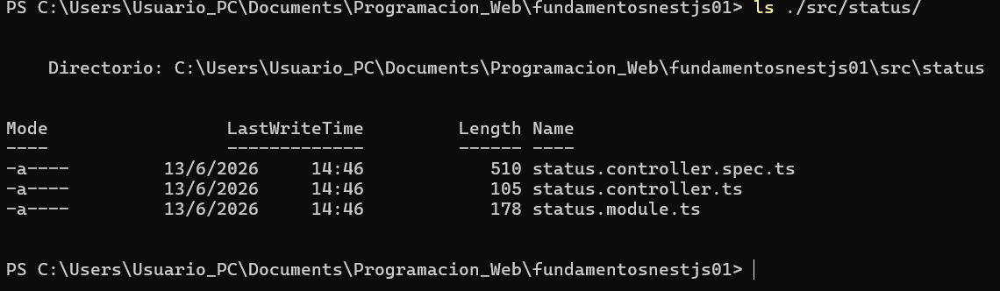

# Práctica 1 (NestJS): Instalación, Configuración Inicial y Primer Endpoint

**Framework:** NestJS (Node.js + TypeScript)

---

## Descripción

Este repositorio contiene el desarrollo de la **Práctica 1** del módulo de Frameworks Backend, en la cual se realiza la instalación y configuración inicial de un proyecto **NestJS**, así como la creación de un primer endpoint profesional (`/api/status`) que reporta el estado del servicio.

---

## Requisitos

| Herramienta | Versión utilizada |
|---|---|
| Node.js | v24.11.0 |
| pnpm | 10.33.2 |
| @nestjs/cli | 11.0.23 |

---

## Instalación y ejecución

\```bash
# 1. Instalar el CLI de NestJS (global)
pnpm install -g @nestjs/cli

# 2. Crear el proyecto
nest new fundamentosnestjs01

# 3. Entrar al proyecto
cd fundamentosnestjs01

# 4. Ejecutar en modo desarrollo
pnpm start
\```

El servidor queda disponible en:

\```
http://localhost:3000
\```

---

## Endpoint implementado

Se creó un módulo y controlador llamados **status**, que expone el siguiente endpoint:

```
GET /api/status
```

---

## Estructura del proyecto

```
fundamentosnestjs01/
 ├── src/
 │    ├── status/
 │    │    ├── status.controller.ts
 │    │    ├── status.controller.spec.ts
 │    │    └── status.module.ts
 │    ├── app.controller.ts
 │    ├── app.module.ts
 │    └── main.ts
 ├── assets/
 ├── package.json
 └── README.md
```

---

## Evidencias

### 1. Verificación de versiones (Node y pnpm)


### 2. Servidor NestJS iniciado correctamente


### 3. Endpoint `/api/status` funcionando


### 4. Estructura generada del módulo status


---

### Explicación de los decoradores utilizados

### `@Controller('api/status')`
Define una clase como **controlador**, es decir, la encargada de manejar las solicitudes HTTP. El texto entre paréntesis establece el **prefijo de ruta** para todos los endpoints dentro de la clase, en este caso `/api/status`.

### `@Get()`
Indica que el método decorado responderá a solicitudes HTTP de tipo **GET**. Al no especificar una ruta adicional, el endpoint queda mapeado directamente a la ruta base del controlador.

### `@Module()`
Define un **módulo**, la unidad básica de organización en NestJS. Cada módulo agrupa controladores, servicios y proveedores relacionados, lo que favorece la escalabilidad y el mantenimiento del proyecto.

---

## 🔄 Funcionamiento del servidor NestJS

Al ejecutar `pnpm start`, NestJS:

1. Inicializa la fábrica de la aplicación (`NestFactory`).
2. Carga e inyecta las dependencias de cada módulo registrado.
3. Resuelve las rutas declaradas en los controladores.
4. Levanta el servidor HTTP (por defecto en el puerto `3000`).

